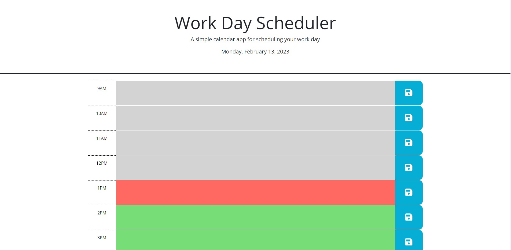

# Challenge 5: Work Day Scheduler

## Description

For this coding challenge, I will be modifying starter code for a calendar application where users can enter events under a time slot in the current day that will be saved in local storage. When the user refreshes the page, the saved events should stil be present. I will be using jQuery to run the neccessary functions. I will be also utilizing the Day.js library for the date and time at the top of the page, which will be updated every second in real time.

## User Story

```
AS AN employee with a busy schedule
I WANT to add important events to a daily planner
SO THAT I can manage my time effectively
```

## Acceptance Criteria

```
GIVEN I am using a daily planner to create a schedule
WHEN I open the planner
THEN the current day is displayed at the top of the calendar
WHEN I scroll down
THEN I am presented with timeblocks for standard business hours
WHEN I view the timeblocks for that day
THEN each timeblock is color coded to indicate whether it is in the past, present, or future
WHEN I click into a timeblock
THEN I can enter an event
WHEN I click the save button for that timeblock
THEN the text for that event is saved in local storage
WHEN I refresh the page
THEN the saved events persist
```

## Deployed Application:
### Link:
```
https://ronasian.github.io/ronans-workdayscheduler/
```
### Images:


## License

This project is licensed under the MIT License - see the LICENSE.md file for details
